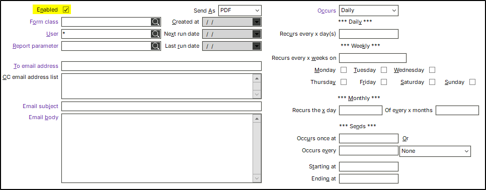
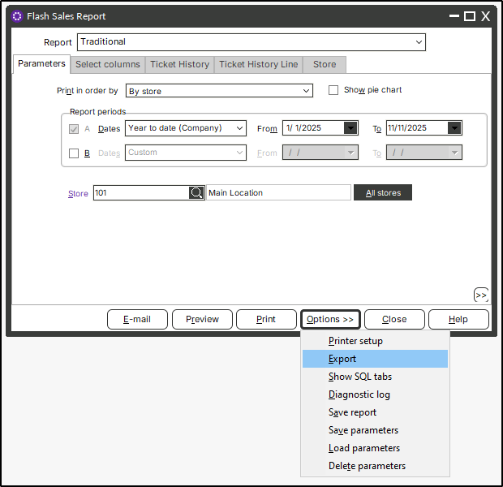
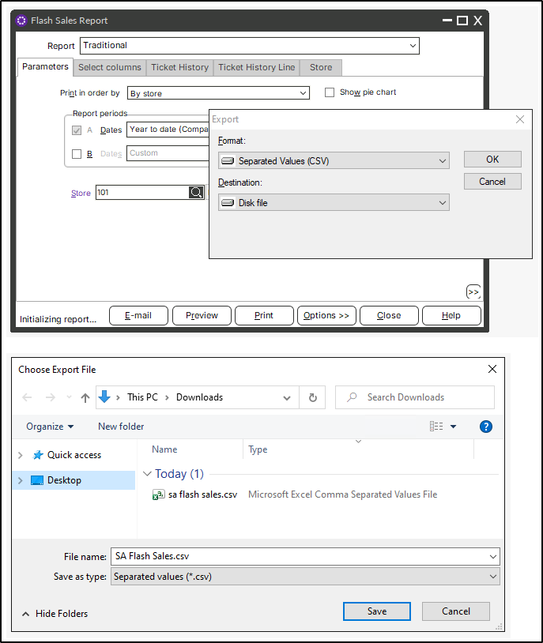
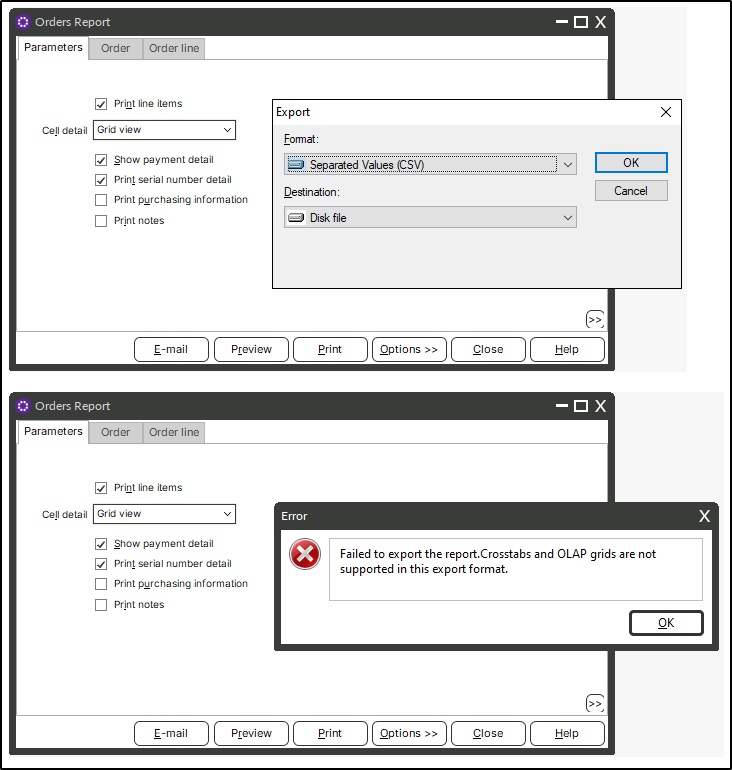
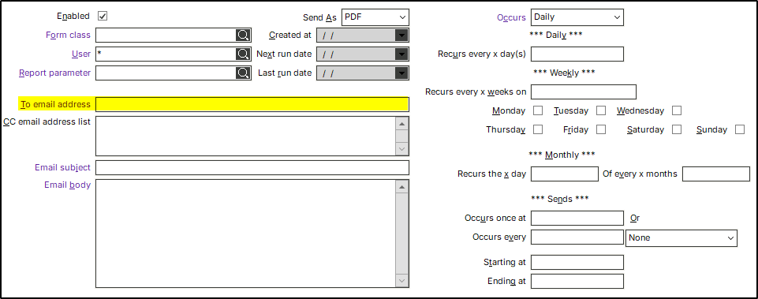
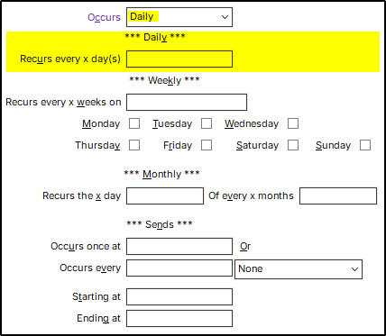
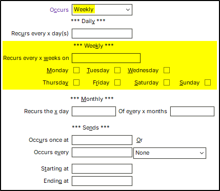
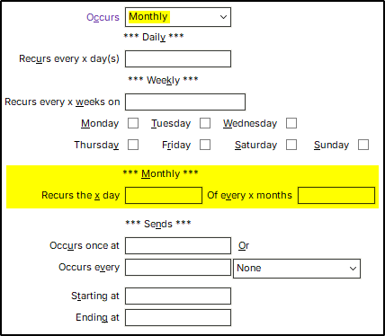
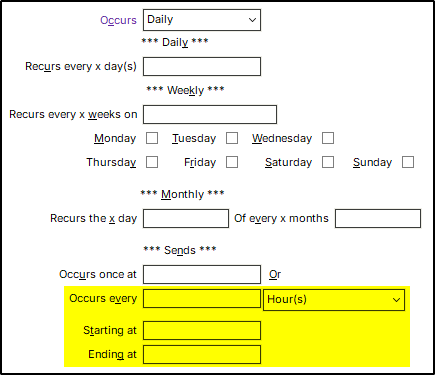

# Rules for Configuring Rapid Automated Reporting  
Updated 11/11/2025  

---

To ensure Rapid Automated Reporting generates reports correctly, the following rules must be adhered to in the Rapid Automated Reporting setup screen. This document can be used to troubleshoot misconfigurations.

---

## Table of Contents

- [Enabled Flag](#enabled-flag)
- [Proper Send As Type](#proper-send-as-type)
- [Email Rules](#email-rules)
- [Daily Rules](#daily-rules)
- [Weekly Rules](#weekly-rules)
- [Monthly Rules](#monthly-rules)
- [Send Time Rules](#send-time-rules)
- [Cross-Rule Consistency](#cross-rule-consistency)

---

## Enabled Flag

- Only reports that are flagged as **`Enabled`** will be generated and emailed.

  

## Proper Send As Type

- Only reports that have a valid **`Send As`** type will be generated and emailed.  
- A valid **`Send As`** type is any export format that the report can successfully produce **manually** (such as **`PDF`**, **`CSV`**, or **`XLS`**).  
  - If the report cannot be manually exported using the selected type, it will also fail when processed by Rapid Automated Reporting..

  

### Recommended validation process

Before relying on Rapid Automated Reporting for a given report:

1. Open the report in Counterpoint with the same parameters that will be used by Rapid Automated Reporting.
2. Manually export the report using the desired **`Send As`** format (for example, **`PDF`**, **`CSV`**, or **`XLS`**).
3. Confirm that the export completes successfully and the output looks correct.

**Beginning an Export Test**

 

**Example of a Valid Export (exports successfully)**

  

**Example of an Invalid Export (encounters an error based on export format)**

  

## Email Rules  

- All email addresses in the **To** (and related) fields must be in a **valid email format**.  
- Invalid addresses (missing `@`, domain, etc.) will be rejected.  

   

## Daily Rules  

- When **`Occurs`** is set to **Daily**, a value **must** be entered in **`Recurs every x day(s)`**.  
- The **`Recurs every x day(s)`** field can **only** be used when **`Occurs`** is set to **Daily**.

  

## Weekly Rules  

- When **`Occurs`** is set to **Weekly**, at least one day of the week **must be selected** (e.g., Monday, Tuesday, etc.).  
- Day-of-week options (Sunday–Saturday) are **only valid** when **`Occurs`** is set to **Weekly**.

  

## Monthly Rules

- When **`Occurs`** is set to **Monthly**, both **`Recurs the x day`** (day of month) *and*  **`Of every x months`** (interval in months) must be specified.  
- The **`Recurs the x day`** and **`Of every x months`** fields can **only** be used when **`Occurs`** is set to **Monthly**.

  

## Send Time Rules

These rules govern the **time-of-day** options (e.g., **`Occurs once at`** vs **`Occurs every`**):  

- Exactly one style **must be chosen**:  
  - Either **`Occurs once at`** *or* **`Occurs every`** with an interval value  
  - Both cannot be left blank, and both cannot be filled in at the same time.  

- Reports **cannot** use the same **`Occurs once at`** time as another report.  
  - **Configuring multiple reports to run at exactly the exact same time may consume excessive resources.**

   

- If **`Occurs every`** is specified, a valid unit of time **must also be selected**, such as **Hour, Minute, or Second**.  

   

## Cross-Rule Consistency  

- The daily recurrence field (**`Recurs every x day(s)`**) must **not** be filled in when the schedule is **Monthly** or **Weekly**.  
- The weekly recurrence fields (day-of-week options) must **not** be used when the schedule is set to **Daily** or **Monthly**.  
- The monthly recurrence fields (**`Recurs the x day`** and **`Of every x months`**) must **not** be filled in when the schedule is **Daily** or **Weekly**.  
